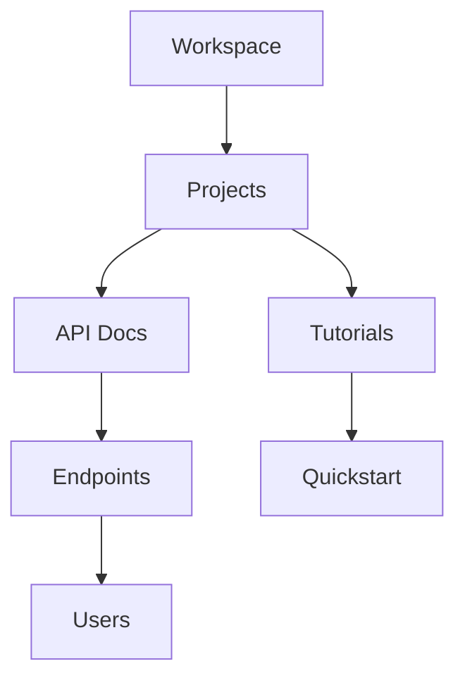

## Overview

learn Documentation empowers you to manage project knowledge efficiently. You organize content into intuitive hierarchies, collaborate securely with teams, track changes through version history, and find information quickly via powerful search. These core features streamline your workflow from initial draft to production-ready docs.

<Columns cols={2}>
  <Card title="Document Hierarchies" icon="layout" href="#document-organization">
    Build nested structures for clear navigation.
  </Card>
  <Card title="Team Collaboration" icon="users" href="#collaboration">
    Share, review, and assign permissions effortlessly.
  </Card>
  <Card title="Version Control" icon="git-branch" href="#version-control">
    Track edits and revert changes with full history.
  </Card>
  <Card title="Advanced Search" icon="search" href="#search">
    Discover content across your entire documentation space.
  </Card>
</Columns>

## Document Organization and Hierarchies

You create logical structures using folders and pages. Nest documents to reflect your project's architecture, such as grouping API references under endpoints or tutorials under guides.



<Steps>
  <Step title="Create a Folder" icon="folder">
    Navigate to your workspace. Click the `+` button and select `New Folder`. Name it based on your project section, like `user-guides`.
  </Step>
  <Step title="Add Nested Pages" icon="file-text">
    Inside the folder, create pages. Use the sidebar to drag and reorder for optimal hierarchy.
  </Step>
  <Step title="Publish Changes" icon="globe">
    Preview your structure, then publish to make it live for your team.
  </Step>
</Steps>

<Callout kind="tip">
  Use consistent naming conventions, such as prefixes like `api-` or `tutorial-`, to enhance discoverability.
</Callout>

## Collaboration and Permissions

Invite team members and control access granularly. You assign roles like Editor, Viewer, or Admin to specific sections.

<Tabs>
  <Tab title="Editor Role" icon="edit-3">
    Editors modify content and reorganize hierarchies.
    
    | Permission | Allowed |
    |------------|---------|
    | Edit pages | Yes    |
    | Delete     | No     |
    | Publish    | Yes    |
  </Tab>
  <Tab title="Viewer Role" icon="eye">
    Viewers read but cannot alter documents.
    
    | Permission | Allowed |
    |------------|---------|
    | Edit pages | No     |
    | Delete     | No     |
    | Publish    | No     |
  </Tab>
</Tabs>

To invite collaborators:

```javascript
// Example API call to add a user (via learn CLI)
await learn.inviteUser({
  email: "team@company.com",
  role: "editor",
  folderId: "proj-123"
});
```

## Version Control and History

Every edit creates a new version. You view diffs, restore previous states, and compare changes side-by-side.

<CodeGroup tabs="CLI,REST API">
  ```bash
  # View history for a page
  learn history get --page-id proj-123/docs/intro.mdx
  
  # Revert to version 5
  learn revert --page-id proj-123/docs/intro.mdx --version 5
  ```
  ```javascript
  // REST API example
  const history = await fetch('/api/pages/proj-123/docs/intro/history');
  const versions = await history.json();
  
  // Revert
  await fetch('/api/pages/proj-123/docs/intro/revert', {
    method: 'POST',
    body: JSON.stringify({ version: 5 })
  });
  ```
</CodeGroup>

<Callout kind="warning">
  Branching is available in Pro plans. Free users get linear history.
</Callout>

## Search and Discoverability

Search spans titles, content, and metadata. You filter by folder, tag, or date for precise results.

<Expandable title="Advanced Search Syntax" default-open="false">
  Use operators like `tag:api` or `folder:projects` to refine queries.
  
  Example query: `"authentication" tag:security folder:api-docs`
  
  ```bash
  # CLI search
  learn search "REST API" --tag security --folder api-docs
  ```
</Expandable>

<ExpandableGroup>
  <Expandable title="Tagging Best Practices">
    Apply tags consistently: `feature`, `bugfix`, `endpoint`. Limit to 5 per page.
  </Expandable>
  <Expandable title="Analytics Integration">
    Track popular searches to improve content structure.
  </Expandable>
</ExpandableGroup>

These features work together to make learn Documentation your central hub for project knowledge. Start organizing today to boost team productivity.