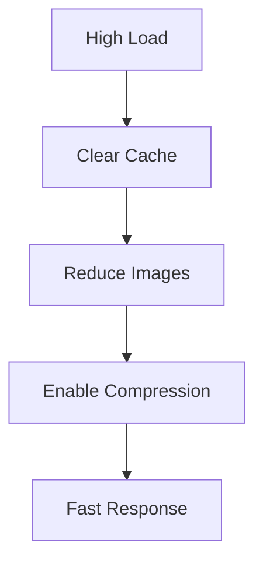

## Quick Fixes Overview

Encounter common issues with learn Documentation? Start here with targeted solutions. Select the category matching your problem.

<Columns cols={2}>
  <Card title="Account & Login" icon="user" href="#account-login">
    Fix authentication errors and access denied messages.
  </Card>
  <Card title="Page Editing" icon="edit-3" href="#page-editing">
    Resolve editor crashes and save failures.
  </Card>
  <Card title="Collaboration" icon="users" href="#collaboration">
    Handle merge conflicts and permission issues.
  </Card>
  <Card title="Performance" icon="zap" href="#performance">
    Optimize loading times and responsiveness.
  </Card>
</Columns>

<Callout kind="tip">
  Before diving in, refresh your browser and clear cache. Many issues resolve with `Ctrl`+`Shift`+`R` (or `Cmd`+`Shift`+`R` on macOS).
</Callout>

## Account and Login Problems

Login failures often stem from browser settings or network restrictions. Follow these steps to regain access.

<Steps>
  <Step title="Check Browser Console" icon="bug">
    Open developer tools (`F12`) and look for errors like `401 Unauthorized`.

    ```javascript
    // Common error in console
    console.error("Failed to fetch /api/auth: 401");
    ```
  </Step>
  <Step title="Reset Password" icon="key">
    Visit `https://app.learn-docs.com/reset-password` and enter your email.
  </Step>
  <Step title="Disable Extensions" icon="shield-off">
    Temporarily disable ad blockers or VPNs that interfere with cookies.
  </Step>
</Steps>

<Tabs>
  <Tab title="Google Chrome" icon="chrome">
    Ensure third-party cookies are enabled in Settings > Privacy and security > Cookies.
  </Tab>
  <Tab title="Firefox" icon="firefox">
    Go to about:config and set `network.cookie.cookieBehavior` to 0.
  </Tab>
</Tabs>

## Page Editing Issues

Editing problems usually involve content limits or syntax errors in MDX.

<CodeGroup tabs="MDX,JSON">
  ```mdx
  <!-- Invalid: Unescaped special chars -->
  Use {variable} directly ❌

  <!-- Fixed -->
  Use `{variable}` ✅
  ```
  ```json
  {
    "error": "Parsing failed: Unexpected token {",
    "line": 42
  }
  ```
</CodeGroup>

<ExpandableGroup>
  <Expandable title="Advanced Editor Reset" default-open="false">
    Clear local storage:

    ```bash
    # In browser console
    localStorage.clear();
    location.reload();
    ```
  </Expandable>
</ExpandableGroup>

## Collaboration Conflicts

Conflicts arise during simultaneous edits. Detect and resolve them promptly.

| Conflict Type | Symptom | Resolution |
|---------------|---------|------------|
| Merge Conflict | Red highlights in editor | Accept current/incoming changes |
| Permission Denied | "Insufficient rights" error | Check workspace roles |
| Stale Data | Outdated preview | Pull latest: `git pull origin main` |

<Callout kind="alert">
  Always communicate with team members before major edits to avoid overlaps.
</Callout>

<Steps>
  <Step title="Resolve Merge" icon="git-merge">
    In the editor, select "Accept Yours" or "Accept Theirs" for each block.
  </Step>
  <Step title="Rebase Locally" icon="git-branch">
    ```bash
    git fetch origin
    git rebase origin/main
    git push --force-with-lease
    ```
  </Step>
</Steps>

## Performance Optimization

Slow loading? Optimize your workspace for better speed.



<Steps>
  <Step title="Compress Images" icon="image">
    Use tools like TinyPNG before uploading. Limit to `<2MB` per image.
  </Step>
  <Step title="Purge Unused Pages" icon="trash-2">
    Archive old drafts via Workspace Settings > Pages.
  </Step>
  <Step title="Enable Caching" icon="database">
    In project settings, toggle "Browser Cache" to `true`.
  </Step>
</Steps>

<Callout kind="success">
  After optimizations, expect `<2s` page loads. Monitor via browser network tab.
</Callout>